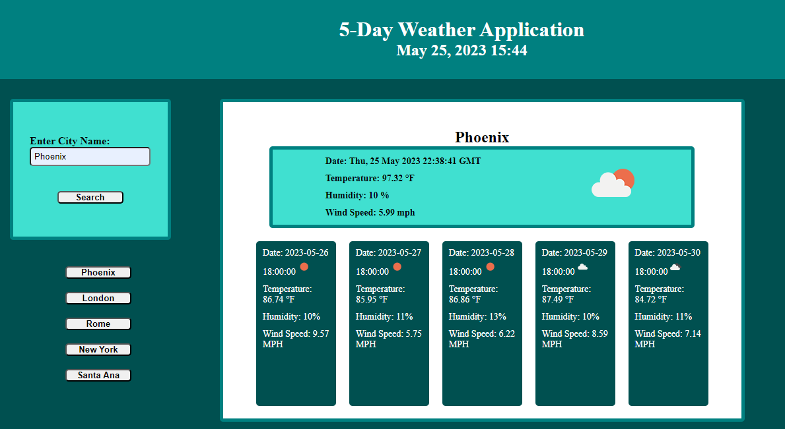

# Weather App

## Description

For this challenge, I created a weather app using OpenWeatherMap's API for the current weather in a queried city, and for the 5 day forecast for that city.

## Installation

N/A

## Usage

When users load the application, they will see a text box that will allow them to enter in a city name. In the application's current state, only the city name should be entered; no state or country should be entered. After submitting the city name, the user will then see the box on the right populate. The turqouise box will populate with that city's current weather data from OpenWeatherMaps including the date and time(At this time, the date and time are converted UNIX timecodes and only presents current GMT). They will also see the temperature in farenheight, the humidity percentage, the wind speed in MPH, as well as an icon that has a brief summary of the current weather including if it is day or night, cloudy, raining, etc. Below the turqoise box is 5 dark teal boxes, each containing the same information but for the next 5 days. 

Any city that is searched through the app is added to local storage where it will be rendered to the page as a clickable button the next time the page loads. Clicking one of these buttons will cause the app to pull up the current and 5-day-out weather data for that city again. 

[Deployed Weather Application (https://adamjohnson92.github.io/Weather-App/)]

## Credits

Assistance with the applications development is courtesy of BCS instructor Rebecca Goldstein with regards to chaining fetch requests together by calling a second or third fetch request within a .then statement of the first fetch request. Additional assistance courtesy of BCS tutor Faran Navazi regarding clearing the dynamically generated divs with .innerHTML = "" to search another city without reloading the page. Faran also assisted with applying the event.target functionality to the previously-searched-city buttons so that they can also run the original fetch requests using the value of the text content. Faran also helped to make sure that only unique city names are pushed to the localStorage array, as well as helping with getting the weather icons to display on the page.

## License

N/A